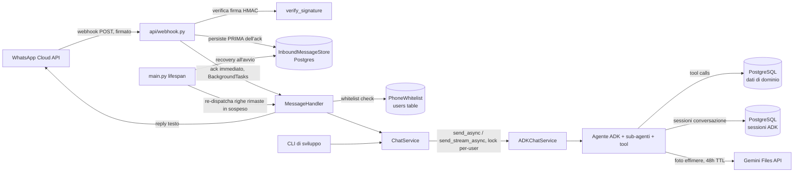

# WhatsApp Assistant — Architettura tecnica

> Documento di recap delle decisioni architetturali prese in fase di brainstorming
>
> - (18/07/2026), aggiornato dopo una revisione critica dell'implementazione
> - (20/07/2026) che ha corretto diversi problemi di robustezza (autenticazione assente, comando Docker di sviluppo in produzione, entry point CLI rotto, perdita di messaggi in caso di crash, race condition sulle sessioni ADK) prima di procedere con gli agenti di dominio.
>
> Complementare a [requirements.md](./requirements.md) (requisiti funzionali/di prodotto) — questo documento riguarda **come** il sistema è costruito tecnicamente.

## 1. Vista d'insieme

Il servizio è un backend FastAPI (questo repository) che riceve messaggi WhatsApp
via webhook, li inoltra a un agente conversazionale (Google ADK) tramite un layer
di astrazione (`ChatService`), e rispedisce la risposta all'utente via WhatsApp
Cloud API. I dati di dominio (ristoranti, eventi, promemoria, liste condivise)
sono persistiti in PostgreSQL.



Componenti principali, in ordine di attraversamento di un messaggio in ingresso:

1. **Webhook** ([api/webhook.py](../src/whatsapp_assistant/api/webhook.py)) — riceve il payload Meta, verifica il token (`GET /webhook`); su `POST /webhook` verifica la firma HMAC (§6.1), persiste ogni messaggio tramite `InboundMessageStore` **prima** di rispondere (§6.2), poi ack immediato (200) e delega l'elaborazione a un `BackgroundTasks` per ogni messaggio nuovo.
2. **MessageHandler** ([services/whatsapp/handler.py](../src/whatsapp_assistant/services/whatsapp/handler.py)) — verifica che il mittente sia in whitelist (§6.1), estrae il messaggio dal payload, gestisce testo e allegati (audio/immagini/video/documenti, tutti inoltrati come allegati grezzi — §5), costruisce un `ChatMessage` e lo passa al `ChatService`.
3. **ChatService** ([services/chat_service/](../src/whatsapp_assistant/services/chat_service/)) — layer di astrazione framework-agnostic tra le interfacce (WhatsApp, CLI) e l'agente. Vedi §3.
4. **Agente ADK** — orchestratore + sub-agenti specializzati (catalogazione, promemoria, liste/task). Vedi §8 (ancora da progettare in dettaglio).
5. **PostgreSQL** — un'unica istanza/container con due database logici separati: dati applicativi (inclusa la coda di durabilità `inbound_messages`, §6.2) e sessioni ADK. Vedi §4.

## 2. Cosa si porta dal progetto di riferimento (dls-chatbot)

Da `/Users/dcatone/Projects/ai/dls-chatbot/dls-chatbot`, **tutto tranne gli
agenti e i tool specifici del dominio condominiale**:

**Portato/adattato (scaffolding completato):**

- Pattern `ChatService` (rivisto, vedi §3 — non identico all'originale) → [src/whatsapp_assistant/services/chat_service/chat_service.py](../src/whatsapp_assistant/services/chat_service/chat_service.py)
- `ADKChatService` + factory del `Runner` → [src/whatsapp_assistant/services/chat_service/impls/adk_chat_service.py](../src/whatsapp_assistant/services/chat_service/impls/adk_chat_service.py)
- Interfaccia CLI per test locali in sviluppo → [src/whatsapp_assistant/interfaces/cli.py](../src/whatsapp_assistant/interfaces/cli.py) (comando `whatsapp-assistant-cli`)
- Pattern error handling per i tool (`@may_fail`/`@may_fail_async`) → [src/whatsapp_assistant/agents/wrappers.py](../src/whatsapp_assistant/agents/wrappers.py)
- Dataclass `Attachment`/`ChatMessage` condivise tra interfacce → [services/chat_service/schemas.py](../src/whatsapp_assistant/services/chat_service/schemas.py)
- Setup Docker/Compose per Postgres → già fatto in §4.3

**Da NON portare:**

- Interfaccia Telegram (bot è WhatsApp-only)
- Agenti/tool del dominio condominiale (`whatsapp_agent`, `domostudio_agent`, `docs_agent` e relativi tool)
- DB `agent_db.sqlite3` e schema condominiale (`Problem`, `Specialist`, ecc.)
- Layer DB sincrono (SQLAlchemy `create_engine`) — sostituito da SQLAlchemy async (`asyncpg`), vedi §4
- Config management custom (path/costanti in `configs/folder.py`) — non applicabile, il progetto usa già Pydantic `Settings`/`.env`

> **Nota sulla struttura file**: un refactor del 20/07/2026 ha riorganizzato i
> path sotto `src/whatsapp_assistant/` (es. `services/handler.py` →
> `services/whatsapp/handler.py`, `cli.py` → `interfaces/cli.py`, `db/models` →
> `database/models`). Questo documento è stato risincronizzato con i path reali
> in quella stessa occasione — se in futuro si sposta ancora qualcosa,
> aggiornare questo file **nello stesso commit**, non dopo: la revisione che ha
> originato questa riscrittura ha trovato un entry point (`whatsapp-assistant-cli`
> in `pyproject.toml`) rimasto rotto per un'intera iterazione perché nessuno lo
> aveva più eseguito dopo lo spostamento.

## 3. `ChatService` — design

**Decisione chiave**: framework-agnostico tramite Template Method con **due**
metodi realmente astratti (`send_async` e `reset_session`) e **due** metodi con
implementazione di default nella classe base (`send_sync`, `send_stream_async`),
sovrascrivibile se il framework offre di meglio. Le sottoclassi concrete (una
per framework agentico) implementano solo i due primitivi comuni.

Implementato in [src/whatsapp_assistant/services/chat_service/chat_service.py](../src/whatsapp_assistant/services/chat_service/chat_service.py):

```python
@dataclass
class Attachment:
    filename: str
    data: bytes
    mime_type: str

@dataclass
class ChatMessage:
    user_id: str
    text: str
    session_id: str | None = None  # None => deriva da user_id, vedi sotto
    attachments: list[Attachment] = field(default_factory=list)


class ChatService(ABC):
    @abstractmethod
    async def send_async(self, message: ChatMessage) -> str:
        """Invia un messaggio e ritorna la risposta completa dell'agente."""

    @abstractmethod
    async def reset_session(self, user_id: str) -> None:
        """Azzera la cronologia della conversazione per questo utente."""

    def send_sync(self, message: ChatMessage) -> str:
        # Default: asyncio.run(...). Uso previsto: SOLO script/tool di
        # manutenzione fuori da un event loop già attivo.
        return asyncio.run(self.send_async(message))

    async def send_stream_async(self, message: ChatMessage) -> AsyncIterator[str]:
        # Default: "finto streaming", un solo chunk.
        yield await self.send_async(message)
```

Prima (e per ora unica) implementazione concreta:
[`ADKChatService(ChatService)`](../src/whatsapp_assistant/services/chat_service/impls/adk_chat_service.py),
che wrappa un `Runner` di Google ADK e converte tra `ChatMessage`/`Attachment`
(tipi canonici, framework-agnostic) e i tipi nativi ADK
(`google.genai.types.Content/Part/Blob`). La conversione resta confinata dentro
questa sottoclasse — nessun tipo ADK trapela verso webhook, handler o CLI.

Da tenere presente: questa astrazione è framework-agnostic all'interfaccia, ma
**non** disaccoppia l'architettura dati da ADK — vedi §4, il vincolo di
`DatabaseSessionService` sul DB relazionale delle sessioni è la ragione stessa
per cui esiste un secondo database Postgres. Un secondo adapter (es. per
`google-genai` diretto) resterebbe comunque da scrivere se cambiasse il
framework agentico.

**Sessione ADK — una per utente, non multi-sessione**: `ChatMessage.session_id`
resta opzionale ma, se omesso, viene risolto in modo deterministico come
`session_id = user_id`. Motivo: WhatsApp non ha il concetto di "nuova
conversazione" (è un unico thread continuo per numero di telefono). Il comando
`/reset` (CLI) azzera la cronologia della sessione corrente invece di aprirne
una nuova.

**Lock per utente** (§6.3): `ADKChatService` serializza `send_async`/
`reset_session` con un `asyncio.Lock` per `user_id`, per evitare che due
messaggi ravvicinati dello stesso utente corrompano la sessione ADK condivisa
correndo in parallelo su `get_or_create_session`/`run_async`.

## 4. Persistenza dati

**Un'unica istanza/container PostgreSQL**, con **due database logici separati**:

| Database | Contenuto | Note |
| --- | --- | --- |
| `whatsapp_assistant` (nome indicativo) | Dati applicativi: item catalogati, categorie, promemoria/eventi, liste condivise, utenti autorizzati, log di durabilità dei messaggi in ingresso (`inbound_messages`, §6.2) | Schema relazionale + colonne `JSONB` per attributi specifici di categoria (vedi §4.1) |
| `agent_sessions` (nome indicativo) | Sessioni di conversazione ADK (`DatabaseSessionService`) | Ciclo di vita "usa e getta", isolato dai dati reali; può essere svuotato/ricreato senza impatto sui dati applicativi |

**Perché due DB nella stessa istanza e non un unico motore per tutto:**
`DatabaseSessionService` di ADK supporta solo DB relazionali via driver async
SQLAlchemy (SQLite, PostgreSQL, MySQL/MariaDB) — nessun backend NoSQL. Le
alternative (`InMemorySessionService`: perde la cronologia ad ogni riavvio;
`VertexAiSessionService`: richiede un intero progetto GCP) sono scartate.
Di conseguenza, usando ADK è necessario un DB relazionale comunque: consolidare
tutto su un'unica istanza Postgres (un solo container da mantenere/backuppare,
due database logici per isolare i cicli di vita) è la soluzione più semplice.

### 4.1 Perché Postgres + JSONB e non NoSQL puro

La libertà di schema richiesta (categorie inventate dall'agente, campi diversi
per tipo di elemento) si ottiene dal **contratto del tool** che l'agente chiama
(es. `save_item(category: str, name: str, attributes: dict)`), non dalla scelta
del motore DB — un `dict` finisce in una colonna `JSONB` con la stessa libertà
con cui finirebbe in un documento Mongo. Con Postgres non serve mai creare una
tabella per categoria: una tabella generica `items` con colonna `attributes
jsonb` accoglie qualunque categoria senza migrazioni.

Vantaggi aggiuntivi di Postgres per questo caso d'uso — **non ancora attivati
nello schema attuale**, restano lavoro futuro (§8):

- Query strutturate/relazioni per promemoria, utenti, liste condivise (non solo
  lookup per chiave) — già disponibile oggi
- Indicizzazione GIN su `JSONB` per filtri su attributi dinamici — **da
  aggiungere**, la migrazione iniziale non la crea
- `pg_trgm` per fuzzy matching (deduplica di item già salvati) — **da
  abilitare** (`CREATE EXTENSION`)
- `pgvector` per ricerca semantica nel recupero in linguaggio naturale (§4.3
  dei requisiti — "che ristoranti abbiamo salvato a Roma?") — **da abilitare**

File Markdown e NoSQL puro sono stati scartati: i primi non gestiscono scritture
concorrenti da due utenti in modo sicuro né relazioni/query strutturate; il
secondo introdurrebbe un secondo motore DB senza un beneficio netto rispetto a
Postgres+JSONB, dato il vincolo di ADK sulle sessioni.

### 4.2 Schema tabelle (`whatsapp_assistant`)

Implementato in [src/whatsapp_assistant/database/models](../src/whatsapp_assistant/database/models) (SQLAlchemy 2.0 async) e gestito con **Alembic** (migrazioni in [alembic/versions](../alembic/versions)).

| Tabella | Colonne principali | Note |
| --- | --- | --- |
| `users` | `id`, `phone_number` (unique), `display_name`, `created_at` | Whitelist dei numeri autorizzati: tabella DB (non config/env), popolata via seed/migrazione manuale. **Effettivamente applicata** da `PhoneWhitelist` (§6.1) — prima della revisione del 20/07 esisteva solo come tabella, senza alcun controllo che la consultasse |
| `categories` | `id`, `name` (unique), `description`, `created_at` | Create dall'utente o inventate dall'agente; nessuna tabella per categoria |
| `items` | `id`, `category_id` (FK), `name`, `notes`, `rating`, `location`, `attributes` (`jsonb`), `created_by` (FK), `created_at`, `updated_at` | Item catalogati di qualsiasi categoria; campi specifici di categoria in `attributes` |
| `lists` | `id`, `list_type` (`shopping`/`task`), `name`, `created_at` | **Tabella generica unificata** per liste della spesa e task condivisi (invece di tabelle dedicate separate) |
| `list_items` | `id`, `list_id` (FK), `description`, `is_checked`, `checked_at`, `attributes` (`jsonb`), `created_by` (FK), `created_at`, `updated_at` | Voce di una lista; per i task, priorità/scadenza/assegnatario vivono in `attributes` invece che in colonne dedicate — stesso pattern di `items.attributes` |
| `reminders` | `id`, `title`, `description`, `due_at` (timestamptz), `timezone` (default `Europe/Rome`), `recurrence_rule`, `status` (`pending`/`sent`/`done`/`cancelled`), `proactive`, `linked_item_id` (FK `items`, nullable), `created_by` (FK), `created_at`, `updated_at` | Vedi sotto per `recurrence_rule` |
| `inbound_messages` | `id`, `wa_message_id` (unique), `phone_number`, `payload` (`json`), `status` (`received`/`processing`/`done`/`failed`), `error`, `received_at`, `processed_at` | Log di durabilità/idempotenza per i messaggi WhatsApp in ingresso — vedi §6.2. `payload` usa `JSON` generico (non `JSONB`) di proposito: è un log di sola scrittura/lettura per id, non serve indicizzazione JSONB, e restare generico permette di testarlo contro SQLite senza un Postgres reale |

**Ricorrenza (`reminders.recurrence_rule`)**: modellata come stringa **RRULE**
(RFC 5545, lo standard iCal usato da Google/Outlook Calendar — es.
`FREQ=YEARLY;INTERVAL=1` per un anniversario, `FREQ=WEEKLY;BYDAY=MO,WE,FR` per
"ogni lun/mer/ven"), invece di un enum semplice + intervallo: è l'opzione più
flessibile e standard, copre anche casi come "ogni ultimo venerdì del mese"
che un enum non coprirebbe, e si interpreta a runtime con la libreria Python
`dateutil.rrule` senza dover scrivere un parser custom. La colonna resta
`nullable`: `NULL` significa evento singolo, non ricorrente.

**Database `agent_sessions`**: nessun modello SQLAlchemy nostro — `DatabaseSessionService`
di ADK gestisce internamente il proprio schema quando gli si passa la connection
string di questo secondo database (creato dallo script di init del container,
vedi §4.3).

### 4.3 Containerizzazione

Aggiunto un servizio `db` a [compose.yaml](../compose.yaml): `postgres:17-alpine`,
volume persistente (`wa-ass-db-data`), rete `internal` separata da
`traefik-network` (il DB **non** è esposto pubblicamente, raggiungibile solo dal
servizio `wa-ass`), porta `5432` mappata solo su `127.0.0.1` per comodità di
sviluppo locale (psql/Alembic da host). Un init script
([db/init/01-create-agent-sessions-db.sh](../db/init/01-create-agent-sessions-db.sh))
crea il secondo database `agent_sessions` al primo avvio (oltre a `whatsapp_assistant`,
creato automaticamente da `POSTGRES_DB`). Credenziali e URL di connessione in
`.env` (vedi `secrets/.env.example`), mai hardcoded — `Settings.database_url` e
`Settings.agent_sessions_database_url` sono campi obbligatori, senza default,
per evitare che l'app parta silenziosamente con credenziali deboli.

> **Punto aperto** (§8): `compose.yaml` e la config di default di
> `pydantic-settings` cercano un file `.env` nella root del repo; nello stato
> attuale del progetto i segreti vivono invece in `secrets/.env`. Chi esegue
> `docker compose up` dalla root senza `--env-file secrets/.env` (o un
> symlink) troverà il container incapace di avviarsi. Non risolto in questa
> revisione perché è una decisione di organizzazione dei segreti che spetta a
> chi gestisce il deploy, non qualcosa da cambiare a colpo di refactor.

**Comando di avvio del container**: `fastapi run` (non `fastapi dev`). `fastapi
dev` è esplicitamente il server di sviluppo di FastAPI — reload automatico,
watcher sul filesystem, non pensato per traffico reale dietro un reverse proxy.
Il [Dockerfile](../Dockerfile) lo usava per errore fino al 20/07/2026: il
container "di produzione" girava di fatto con un dev server.

Migrazioni: **Alembic**, configurato per SQLAlchemy async (`alembic init -t async`),
con `alembic/env.py` che legge l'URL da `Settings` invece che da un valore
statico in `alembic.ini` (unica fonte di verità per la connection string).
Verificato end-to-end su un container Postgres reale: `alembic revision
--autogenerate` genera la migrazione dai modelli, `alembic upgrade head` la
applica correttamente (7 tabelle ad oggi, incluso `inbound_messages`).

## 5. Gestione media

- **Audio**: **nessuna trascrizione separata** — un vocale è scaricato e
  inoltrato all'agente come allegato grezzo (`Attachment`, stesso trattamento
  di immagini/video/documenti), che lo passa al modello multimodale così
  com'è. Una versione precedente passava per OpenAI Whisper
  (`services/transcription.py`, ora rimosso): prima ancora, un refactor aveva
  addirittura scollegato quella chiamata da `MessageHandler` senza che nessuno
  se ne accorgesse (il campo `_transcription` veniva passato ma mai usato).
  Piuttosto che ripristinare un secondo componente/provider (OpenAI) solo per
  la trascrizione quando il modello multimodale già in uso (Gemini) gestisce
  audio nativamente, si è scelto di eliminare la trascrizione: un livello in
  meno da mantenere, un secondo provider/API key in meno, stesso trattamento
  di tutti gli altri allegati.
- **Foto**: uso **effimero** confermato (analisi via modello multimodale, poi si scarta l'immagine mantenendo solo i dati estratti in Postgres). Si riusa il pattern già presente in [services/gemini_media.py](../src/whatsapp_assistant/services/gemini_media.py) (upload diretto a Gemini Files API, gratuito, auto-espira dopo 48h) — **nessun bucket/object storage necessario per questo flusso**.
- **Object storage (MinIO/S3/GCS)**: **deferred/YAGNI**. Nessun caso d'uso concreto e vicino oggi (richiederebbe che l'agente generi file di output — PDF, export — da restituire all'utente via link). Se in futuro servirà, l'interfaccia prevista è un `Protocol` `ObjectStorage` (`upload`, `presigned_get_url`, `presigned_put_url`, `delete`) con un'unica implementazione basata su `boto3`.
- **Link**: da progettare (non ancora discusso in dettaglio — punto aperto in requirements.md §7.7).

## 6. Sicurezza e affidabilità del canale WhatsApp

Questa sezione è stata aggiunta il 20/07/2026 dopo una revisione critica che ha
trovato il canale WhatsApp completamente privo di autenticazione e privo di
qualunque garanzia di non perdere messaggi in caso di crash. Sono tre problemi
distinti, risolti con tre meccanismi indipendenti.

### 6.1 Autenticazione: chi può parlare con il bot

Prima di questa revisione, **nessun codice** verificava che un messaggio in
ingresso venisse davvero da uno dei due numeri autorizzati, né che una
richiesta `POST /webhook` venisse davvero da Meta. La tabella `users` esisteva
già (§4.2) ma nulla la interrogava: chiunque scoprisse l'URL del webhook poteva
far elaborare messaggi arbitrari al bot, con costo LLM a carico del budget
mensile di requirements.md §6.

Due controlli indipendenti, entrambi ora attivi:

1. **Firma del payload** ([services/whatsapp/signature.py](../src/whatsapp_assistant/services/whatsapp/signature.py)): Meta firma ogni `POST /webhook` con HMAC-SHA256 sul body, chiave l'app secret (header `X-Hub-Signature-256`). `verify_signature()` la ricalcola e la confronta con `hmac.compare_digest` (a tempo costante, per evitare timing attack sul confronto). Richiede il nuovo campo obbligatorio `Settings.whatsapp_app_secret` (Meta App > Settings > Basic). Una firma assente o non valida → `401`, il payload non viene nemmeno parsato.
2. **Whitelist del mittente** ([services/whatsapp/authorization.py](../src/whatsapp_assistant/services/whatsapp/authorization.py)): `PhoneWhitelist.is_authorized(phone_number)` interroga `users` per `phone_number`. `MessageHandler.handle_message` la chiama come primissimo passo, prima di scaricare allegati o chiamare l'agente — un numero non in whitelist non genera alcuna chiamata a pagamento né alcuna risposta (ignorato silenziosamente, non "rifiutato con messaggio": non ha senso confermare a un numero sconosciuto che il bot esiste).

### 6.2 Durabilità e idempotenza: niente si perde, niente si duplica

**Il problema**: il pattern esistente ("ack 200 subito, elabora in
`BackgroundTasks`") è corretto per evitare che Meta ritenti il webhook mentre
si aspetta una risposta lenta — ma una volta risposto 200, **quel messaggio è
interamente responsabilità nostra**: Meta non lo reinvierà mai più. Se il
processo crasha a metà elaborazione (o viene riavviato), il messaggio va perso
senza che nessuno se ne accorga.

**Ricerca sul comportamento di retry di WhatsApp Cloud API**: la consegna dei
webhook di Meta è *at-least-once* (lo stesso messaggio può arrivare più volte,
specie durante retry), e il comportamento di retry/backoff su una risposta non-200
non è documentato con precisione sufficiente da potercisi affidare come unico
meccanismo di affidabilità — Meta può ritentare con backoff per un periodo
limitato e, dopo ripetuti fallimenti, può disabilitare la subscription del
webhook. Non rispondere subito 200 (per "guadagnare tempo" tramite i retry di
Meta) è quindi sia rischioso (subscription disabilitata) sia insufficiente (i
retry non coprono comunque un crash *dopo* un 200 già inviato). La conclusione
operativa: **la durabilità deve essere nostra, non delegata a Meta** — l'ack
veloce resta, ma solo dopo aver scritto il messaggio in modo durevole.

**Soluzione**: [`InboundMessageStore`](../src/whatsapp_assistant/services/whatsapp/inbound_store.py),
tabella `inbound_messages` (§4.2), con una macchina a stati esplicita
(`InboundMessageStatus`: `received` → `processing` → `done`/`failed`). Il
webhook ora:

1. verifica la firma (§6.1);
2. **persiste** ogni messaggio del payload con `record_all()` (stato iniziale
   `received`), unique su `wa_message_id`;
3. **solo dopo il commit**, ack 200 ed elaborazione in background per id
   (`MessageHandler.process_stored_message(message_id)`, che porta la riga a
   `processing` e poi a `done`/`failed`), non più passando il payload grezzo.

**Cosa succede a un `wa_message_id` già visto** (Meta redelivera, non è
un'eccezione ma il comportamento normale di una consegna at-least-once) —
dipende dallo stato attuale della riga:

| Stato esistente | Comportamento sulla redelivery | Perché |
| --- | --- | --- |
| `received` / `processing` | **skip**, nessun nuovo dispatch | è già in corso (o sta per esserlo) — un secondo dispatch concorrente correrebbe sullo stesso messaggio |
| `done` | **skip** | già gestito e già risposto — rielaborarlo manderebbe una risposta duplicata |
| `failed` | **retry**: la riga torna a `received` (errore/`processed_at` azzerati) e viene ridispatchata | un tentativo precedente è fallito e nessun altro meccanismo lo riproverà mai da solo — la redelivery di Meta è un tentativo "gratuito" da non sprecare |

Il passaggio `failed` → `received` è un **compare-and-swap** (`UPDATE ...
WHERE status = 'failed'`, non una scrittura incondizionata): se due
redelivery dello stesso messaggio arrivano quasi in contemporanea, solo una
vince la retry e viene ridispatchata, l'altra vede `rowcount == 0` e si ferma
(`tests/test_inbound_store.py::test_concurrent_redelivery_of_failed_message_retries_only_once`
lo verifica con `asyncio.gather` su due `record_all` concorrenti).

Questa logica copre solo le redelivery *innescate da Meta*; non riprova da
sola un messaggio `failed` che Meta non reinvia mai più (perché magari non
c'è stato nessun problema di consegna dal suo punto di vista) — per quel
caso serve visibilità operativa (punto aperto, §9), non un retry automatico:
un retry automatico incondizionato su `failed` rischierebbe di rientrare in
loop su un payload strutturalmente malformato che fallirà sempre.

Se il processo muore tra il passo 2 e la fine dell'elaborazione, il messaggio
resta comunque scritto in `inbound_messages` con stato `received` o
`processing` — questo è un caso diverso dal retry su `failed` sopra: qui il
processo non ha mai raggiunto un esito, quindi non ha senso aspettare una
redelivery di Meta (potrebbe non arrivare mai). `recover_unfinished_messages()`
([services/whatsapp/recovery.py](../src/whatsapp_assistant/services/whatsapp/recovery.py))
gira una volta ad ogni avvio dell'app (`main.py`, `lifespan`), interroga le
righe non ancora `done`/`failed` e le rielabora attraverso lo stesso
`process_stored_message` — nessuna coda esterna (Redis/RabbitMQ) necessaria a
questa scala (due utenti): la tabella stessa è la coda, e "cosa non è
finito" è una query, non uno stato da sincronizzare altrove. Il recovery è
avvolto in un `try/except` che logga ed entra comunque in funzione anche se il
DB non è raggiungibile all'avvio, per non bloccare il boot dell'app per un
problema transitorio.

### 6.3 Race condition sulle sessioni ADK

`ADKChatService._get_or_create_session` è un check-then-act (`get_session`,
poi `create_session` se assente) senza lock: due messaggi ravvicinati dello
stesso utente (es. un vocale seguito subito da un testo) potevano correre in
parallelo su questo path e su `Runner.run_async` per la stessa sessione ADK,
rischiando di correre sulla creazione della sessione e di interfogliare gli
aggiornamenti di stato del Runner. Risolto con un `asyncio.Lock` per
`user_id` (§3), che serializza `send_async`/`reset_session` per lo stesso
utente senza serializzare utenti diversi tra loro (verificato in
`tests/test_adk_chat_service.py`, inclusa una prova di concorrenza che fallisce
deliberatamente se il lock viene rimosso). Il dizionario dei lock non viene mai
svuotato — accettabile a due utenti fissi (requirements.md §2); andrebbe
rivisto se il numero di utenti diventasse imprevedibile.

## 7. Interfacce

- **WhatsApp** (produzione): unica interfaccia utente-facing. Nessuno streaming (l'API WhatsApp non supporta risposte parziali) — usa `send_async`.
- **CLI** (sviluppo): [interfaces/cli.py](../src/whatsapp_assistant/interfaces/cli.py), comando `whatsapp-assistant-cli`. Per testare l'agente in locale senza passare da Meta/WhatsApp. Non-streaming per semplicità (può comunque usare `send_stream_async` se utile per un'animazione "typing" in locale). L'entry point in `pyproject.toml` puntava al vecchio path (`whatsapp_assistant.cli`, rimosso dal refactor del 20/07) ed era inoltre rotto da un errore di sintassi Python 2 (`except EOFError, KeyboardInterrupt:`) — nessuno se n'era accorto perché nessun test invoca l'entry point pubblicato; entrambi corretti in questa revisione.
- **WAHA**: modulo mantenuto nel repository come da requisiti ([api/waha.py](../src/whatsapp_assistant/api/waha.py)), non attivo/non target dello sviluppo attuale. È comunque montato incondizionatamente in `main.py` ed espone `POST /bot` senza alcuna autenticazione: da tenere presente finché resta nel path di produzione (punto aperto, §8).

## 8. Testing e coverage

Suite in [tests/](../tests/), eseguita con `pytest` (`asyncio_mode = "auto"`,
niente marker espliciti sui test async). Copertura misurata con
`pytest-cov`, configurata in `pyproject.toml` (`[tool.coverage.*]`):

```bash
./scripts/run_coverage.sh          # suite completa, report a terminale + HTML
./scripts/run_coverage.sh -k webhook   # argomenti extra inoltrati a pytest
```

Il report HTML va in `htmlcov/index.html` (gitignored).

Note sulla strategia di test:

- **Unit test con mock** per `MessageHandler`, il webhook FastAPI (via
  `TestClient` + `dependency_overrides`), e `ADKChatService` (con un
  `Runner`/`SessionService` finti — nessuna dipendenza da Google ADK reale nei
  test).
- **Test contro un vero motore DB, ma SQLite in-memory**, per `PhoneWhitelist`
  e `InboundMessageStore` ([tests/db_utils.py](../tests/db_utils.py)): la
  DDL viene generata solo per la tabella sotto test
  (`Base.metadata.create_all(..., tables=[...])`), il che aggira il fatto che
  `Item`/`ListItem` usano `postgresql.JSONB` (non creabile su SQLite) senza
  richiedere un Postgres reale per test veloci e isolati. `inbound_messages`
  usa apposta `JSON` generico invece di `JSONB` per restare testabile così.
- **Test di concorrenza** per il lock per-utente di `ADKChatService`: usano
  `asyncio.Event` per forzare deterministicamente l'interfogliamento (o la sua
  assenza) tra due `send_async` concorrenti, invece di basarsi su `sleep()` e
  tempistiche reali.
- Prima di questa revisione, 4 test su 24 fallivano già su `main` (drift tra
  `tests/test_handler.py` e il comportamento reale dopo il refactor del
  20/07) senza che nessuno se ne fosse accorto — la suite non veniva eseguita
  regolarmente. Tutti i test ora passano (48/48); vale la pena far girare
  `./scripts/run_coverage.sh` in CI per non tornare in quella situazione.

Aree ancora scoperte/parzialmente coperte (percentuali dall'ultimo run):
`api/waha.py` (42%, modulo non attivo — §7), `services/gemini_media.py` (0%,
non ancora esercitato da nessun test), `agents/wrappers.py` (0%, decoratori non
ancora usati da nessun tool reale — §9 punto 1), `configs/folder.py` (79%,
codice ereditato da dls-chatbot non applicabile a questo progetto, vedi §2
"Da NON portare").

## 9. Punti ancora aperti (da affrontare nelle prossime fasi)

1. Design degli agenti ADK per il dominio: orchestratore + sub-agenti (catalogazione con inferenza categorie, promemoria proattivi con fallback su budget, liste/task condivisi), tool e relativi schemi Pydantic — sostituirà [placeholder_agent.py](../src/whatsapp_assistant/agents/placeholder_agent.py).
2. Meccanismo di trigger per `reset_session` lato utente (keyword tipo "/reset" nel testo? comando esplicito? quick reply WhatsApp?) — implementato lato `ChatService`/CLI, non ancora deciso per il canale WhatsApp reale.
3. Gestione dei link (requirements.md §7.7) — non ancora discusso.
4. Requisiti di disponibilità/affidabilità (requirements.md §7.9) — §6 di questo documento copre "non perdere/duplicare messaggi", ma non definisce SLA/tempo massimo di risposta.
5. Popolamento iniziale della tabella `users` (seed dei 2 numeri autorizzati) — da fare a mano o via comando/migrazione dati, non ancora deciso. Ora è un blocco funzionale reale (non solo dati mancanti): senza righe in `users`, `PhoneWhitelist` rifiuta ogni messaggio.
6. Verifica end-to-end di `ADKChatService.send_async` con una API key Gemini reale (finora testata solo la gestione sessioni e il lock, non la chiamata al modello con credenziali vere).
7. Indicizzazione GIN su `items.attributes`/`list_items.attributes`, estensioni `pg_trgm`/`pgvector` (§4.1) — nessuna delle tre è ancora nello schema.
8. Disallineamento fra la posizione reale dei segreti (`secrets/.env`) e quella attesa da `compose.yaml`/`pydantic-settings` (`.env` in root) — §4.3.
9. `api/waha.py` montato incondizionatamente e senza autenticazione in `main.py` pur non essendo il canale attivo — da mettere dietro un flag di configurazione o rimuovere dal routing se resta inutilizzato a lungo.
10. Nessun rate limiting né circuit breaker legato al budget mensile (requirements.md §6): la whitelist (§6.1) risolve "chi può parlare col bot", non "quanto può costare se i due utenti autorizzati lo usano molto".
11. Nessuna visibilità operativa su righe `inbound_messages` rimaste `failed` senza che Meta le reinvii mai (§6.2): oggi restano lì silenziosamente. Servirebbe almeno un modo per accorgersene (query manuale, alert, un comando CLI che le elenca) prima di poter dire che "niente si perde" è davvero garantito end-to-end.
