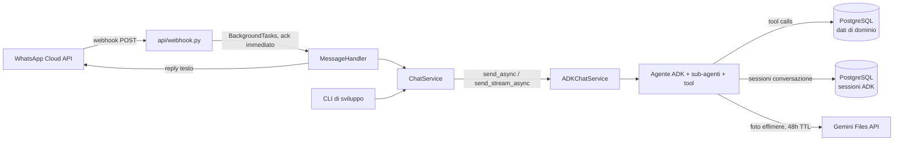

# WhatsApp Assistant — Architettura tecnica

> Documento di recap delle decisioni architetturali prese in fase di brainstorming
> (18/07/2026), prima di procedere con schema dati, scaffolding del codice e
> implementazione degli agenti. Complementare a [requirements.md](./requirements.md)
> (requisiti funzionali/di prodotto) — questo documento riguarda **come** il
> sistema è costruito tecnicamente.

## 1. Vista d'insieme

Il servizio è un backend FastAPI (questo repository) che riceve messaggi WhatsApp
via webhook, li inoltra a un agente conversazionale (Google ADK) tramite un layer
di astrazione (`ChatService`), e rispedisce la risposta all'utente via WhatsApp
Cloud API. I dati di dominio (ristoranti, eventi, promemoria, liste condivise)
sono persistiti in PostgreSQL.



Componenti principali, in ordine di attraversamento di un messaggio in ingresso:

1. **Webhook** ([api/webhook.py](../src/whatsapp_assistant/api/webhook.py)) — riceve il payload Meta, verifica il token (`GET /webhook`), ack immediato (200) e delega l'elaborazione a un `BackgroundTasks` (`POST /webhook`). Pattern già presente e da mantenere.
2. **MessageHandler** ([services/handler.py](../src/whatsapp_assistant/services/handler.py)) — estrae il messaggio dal payload nidificato, gestisce audio (trascrizione esistente) e testo/immagini (nuovo), costruisce un `ChatMessage` e lo passa al `ChatService`.
3. **ChatService** — layer di astrazione framework-agnostic tra le interfacce (WhatsApp, CLI) e l'agente. Vedi §3.
4. **Agente ADK** — orchestratore + sub-agenti specializzati (catalogazione, promemoria, liste/task). Vedi §5 (da discutere in dettaglio in una fase successiva).
5. **PostgreSQL** — un'unica istanza/container con due database logici separati: dati applicativi e sessioni ADK. Vedi §4.

## 2. Cosa si porta dal progetto di riferimento (dls-chatbot)

Da `/Users/dcatone/Projects/ai/dls-chatbot/dls-chatbot`, **tutto tranne gli
agenti e i tool specifici del dominio condominiale**:

**Da portare/adattare:**

- Pattern `ChatService` (rivisto, vedi §3 — non identico all'originale)
- Interfaccia CLI per test locali in sviluppo
- Config management (Pydantic `Settings`, path/costanti separati)
- Setup Docker/Compose per Postgres
- Pattern error handling per i tool (`@may_fail`-style: mai un'eccezione grezza arriva all'agente)
- Dataclass `Attachment` condivisa tra interfacce

**Da NON portare:**

- Interfaccia Telegram (bot è WhatsApp-only)
- Agenti/tool del dominio condominiale (`whatsapp_agent`, `domostudio_agent`, `docs_agent` e relativi tool)
- DB `agent_db.sqlite3` e schema condominiale (`Problem`, `Specialist`, ecc.)
- Layer DB sincrono (SQLAlchemy `create_engine`) — il progetto attuale è async-first, va usato SQLAlchemy async (`asyncpg`) o SQLModel async

## 3. `ChatService` — design

**Decisione chiave**: framework-agnostico tramite Template Method con un solo
metodo realmente astratto. Le sottoclassi concrete (una per framework agentico)
implementano solo il primitivo comune; gli altri due metodi hanno
un'implementazione di default nella classe base, sovrascrivibile se il framework
offre di meglio.

```python
@dataclass
class Attachment:
    filename: str
    data: bytes
    mime_type: str

@dataclass
class ChatMessage:
    user_id: str
    session_id: str | None
    text: str
    attachments: list[Attachment] = field(default_factory=list)


class ChatService(ABC):
    @abstractmethod
    async def send_async(self, message: ChatMessage) -> str:
        """Unico metodo che ogni framework deve implementare."""

    def send_sync(self, message: ChatMessage) -> str:
        # Default: asyncio.run(...). Uso previsto: SOLO script/tool di
        # manutenzione fuori da un event loop già attivo (mai da
        # webhook/CLI, altrimenti RuntimeError).
        return asyncio.run(self.send_async(message))

    async def send_stream_async(self, message: ChatMessage) -> AsyncIterator[str]:
        # Default: "finto streaming", un solo chunk. Sovrascritto dalle
        # sottoclassi che supportano streaming reale (es. ADK SSE).
        yield await self.send_async(message)
```

Prima (e per ora unica) implementazione concreta: `ADKChatService(ChatService)`,
che wrappa un `Runner` di Google ADK e converte tra `ChatMessage`/`Attachment`
(tipi canonici, framework-agnostic) e i tipi nativi ADK
(`google.genai.types.Content/Part/Blob`). La conversione resta confinata dentro
questa sottoclasse — nessun tipo ADK trapela verso webhook, handler o CLI.

Non si costruisce un secondo adapter (es. per chiamate dirette a `google-genai`)
finché non serve davvero (YAGNI) — il contratto astratto è già pronto ad
accoglierlo in futuro.

## 4. Persistenza dati

**Un'unica istanza/container PostgreSQL**, con **due database logici separati**:

| Database | Contenuto | Note |
| --- | --- | --- |
| `whatsapp_assistant` (nome indicativo) | Dati applicativi: item catalogati, categorie, promemoria/eventi, liste condivise, utenti autorizzati | Schema relazionale + colonne `JSONB` per attributi specifici di categoria (vedi §4.1) |
| `agent_sessions` (nome indicativo) | Sessioni di conversazione ADK (`DatabaseSessionService`) | Ciclo di vita "usa e getta", isolato dai dati reali; può essere svuotato/ricreato senza impatto sui dati applicativi |

**Perché due DB nella stessa istanza e non un unico motore per tutto:**
`DatabaseSessionService` di ADK supporta solo DB relazionali via driver async
SQLAlchemy (SQLite, PostgreSQL, MySQL/MariaDB) — nessun backend NoSQL. Le
alternative (`InMemorySessionService`: perde la cronologia ad ogni riavvio;
`VertexAiSessionService`: richiede un intero progetto GCP) sono scartate.
Di conseguenza, usando ADK è necessario un DB relazionale comunque: consolidare
tutto su un'unica istanza Postgres (un solo container da mantenere/backuppare,
due database logici per isolare i cicli di vita) è la soluzione più semplice.

### 4.1 Perché Postgres + JSONB e non NoSQL puro

La libertà di schema richiesta (categorie inventate dall'agente, campi diversi
per tipo di elemento) si ottiene dal **contratto del tool** che l'agente chiama
(es. `save_item(category: str, name: str, attributes: dict)`), non dalla scelta
del motore DB — un `dict` finisce in una colonna `JSONB` con la stessa libertà
con cui finirebbe in un documento Mongo. Con Postgres non serve mai creare una
tabella per categoria: una tabella generica `items` con colonna `attributes
jsonb` accoglie qualunque categoria senza migrazioni.

Vantaggi aggiuntivi di Postgres per questo caso d'uso:

- Query strutturate/relazioni per promemoria, utenti, liste condivise (non solo
  lookup per chiave)
- Indicizzazione GIN su `JSONB` per filtri su attributi dinamici
- `pg_trgm` per fuzzy matching (deduplica di item già salvati)
- `pgvector` per ricerca semantica nel recupero in linguaggio naturale (§4.3
  dei requisiti — "che ristoranti abbiamo salvato a Roma?")

File Markdown e NoSQL puro sono stati scartati: i primi non gestiscono scritture
concorrenti da due utenti in modo sicuro né relazioni/query strutturate; il
secondo introdurrebbe un secondo motore DB senza un beneficio netto rispetto a
Postgres+JSONB, dato il vincolo di ADK sulle sessioni.

### 4.2 Schema tabelle (`whatsapp_assistant`)

Implementato in [src/whatsapp_assistant/db/models](../src/whatsapp_assistant/db/models) (SQLAlchemy 2.0 async) e gestito con **Alembic** (migrazione iniziale in [alembic/versions](../alembic/versions)).

| Tabella | Colonne principali | Note |
| --- | --- | --- |
| `users` | `id`, `phone_number` (unique), `display_name`, `created_at` | Whitelist dei numeri autorizzati: tabella DB (non config/env), popolata via seed/migrazione manuale — sono solo 2 utenti fissi ma una tabella permette di aggiungerne altri senza redeploy |
| `categories` | `id`, `name` (unique), `description`, `created_at` | Create dall'utente o inventate dall'agente; nessuna tabella per categoria |
| `items` | `id`, `category_id` (FK), `name`, `notes`, `rating`, `location`, `attributes` (`jsonb`), `created_by` (FK), `created_at`, `updated_at` | Item catalogati di qualsiasi categoria; campi specifici di categoria in `attributes` |
| `lists` | `id`, `list_type` (`shopping`/`task`), `name`, `created_at` | **Tabella generica unificata** per liste della spesa e task condivisi (invece di tabelle dedicate separate) |
| `list_items` | `id`, `list_id` (FK), `description`, `is_checked`, `checked_at`, `attributes` (`jsonb`), `created_by` (FK), `created_at`, `updated_at` | Voce di una lista; per i task, priorità/scadenza/assegnatario vivono in `attributes` invece che in colonne dedicate — stesso pattern di `items.attributes` |
| `reminders` | `id`, `title`, `description`, `due_at` (timestamptz), `timezone` (default `Europe/Rome`), `recurrence_rule`, `status` (`pending`/`sent`/`done`/`cancelled`), `proactive`, `linked_item_id` (FK `items`, nullable), `created_by` (FK), `created_at`, `updated_at` | Vedi sotto per `recurrence_rule` |

**Ricorrenza (`reminders.recurrence_rule`)**: modellata come stringa **RRULE**
(RFC 5545, lo standard iCal usato da Google/Outlook Calendar — es.
`FREQ=YEARLY;INTERVAL=1` per un anniversario, `FREQ=WEEKLY;BYDAY=MO,WE,FR` per
"ogni lun/mer/ven"), invece di un enum semplice + intervallo: è l'opzione più
flessibile e standard, copre anche casi come "ogni ultimo venerdì del mese"
che un enum non coprirebbe, e si interpreta a runtime con la libreria Python
`dateutil.rrule` senza dover scrivere un parser custom. La colonna resta
`nullable`: `NULL` significa evento singolo, non ricorrente.

**Database `agent_sessions`**: nessun modello SQLAlchemy nostro — `DatabaseSessionService`
di ADK gestisce internamente il proprio schema quando gli si passa la connection
string di questo secondo database (creato dallo script di init del container,
vedi §4.3).

### 4.3 Containerizzazione

Aggiunto un servizio `db` a [compose.yaml](../compose.yaml): `postgres:17-alpine`,
volume persistente (`wa-ass-db-data`), rete `internal` separata da
`traefik-network` (il DB **non** è esposto pubblicamente, raggiungibile solo dal
servizio `wa-ass`), porta `5432` mappata solo su `127.0.0.1` per comodità di
sviluppo locale (psql/Alembic da host). Un init script
([db/init/01-create-agent-sessions-db.sh](../db/init/01-create-agent-sessions-db.sh))
crea il secondo database `agent_sessions` al primo avvio (oltre a `whatsapp_assistant`,
creato automaticamente da `POSTGRES_DB`). Credenziali e URL di connessione in
`.env` (vedi `.env.example`), mai hardcoded — `Settings.database_url` e
`Settings.agent_sessions_database_url` sono campi obbligatori, senza default,
per evitare che l'app parta silenziosamente con credenziali deboli.

Migrazioni: **Alembic**, configurato per SQLAlchemy async (`alembic init -t async`),
con `alembic/env.py` che legge l'URL da `Settings` invece che da un valore
statico in `alembic.ini` (unica fonte di verità per la connection string).
Verificato end-to-end: `alembic revision --autogenerate` genera la migrazione
iniziale dai modelli, `alembic upgrade head` la applica creando correttamente
le 6 tabelle su un container Postgres reale.

## 5. Gestione media

- **Audio**: già implementato — trascrizione via OpenAI Whisper (`gpt-4o-transcribe`), invariato.
- **Foto**: uso **effimero** confermato (analisi via modello multimodale, poi si scarta l'immagine mantenendo solo i dati estratti in Postgres). Si riusa il pattern già presente in [services/gemini_media.py](../src/whatsapp_assistant/services/gemini_media.py) (upload diretto a Gemini Files API, gratuito, auto-espira dopo 48h) — **nessun bucket/object storage necessario per questo flusso**.
- **Object storage (MinIO/S3/GCS)**: **deferred/YAGNI**. Nessun caso d'uso concreto e vicino oggi (richiederebbe che l'agente generi file di output — PDF, export — da restituire all'utente via link). Se in futuro servirà, l'interfaccia prevista è un `Protocol` `ObjectStorage` (`upload`, `presigned_get_url`, `presigned_put_url`, `delete`) con un'unica implementazione basata su `boto3` (endpoint configurabile: copre MinIO, AWS S3 e GCS in modalità interoperabilità S3 senza classi separate per provider). Nota: la Gemini API supporta comunque input immagine da URL pubblico arbitrario (`{"type": "image", "uri": "https://..."}`), quindi un domani un presigned URL MinIO sarebbe utilizzabile anche per quel percorso, se necessario.
- **Link**: da progettare (non ancora discusso in dettaglio — punto aperto in requirements.md §7.7).

## 6. Interfacce

- **WhatsApp** (produzione): unica interfaccia utente-facing. Nessuno streaming (l'API WhatsApp non supporta risposte parziali) — usa `send_async`.
- **CLI** (sviluppo): per testare l'agente in locale senza passare da Meta/WhatsApp. Non-streaming per semplicità (può comunque usare `send_stream_async` se utile per un'animazione "typing" in locale).
- **WAHA**: modulo mantenuto nel repository come da requisiti, non attivo/non target dello sviluppo attuale.

## 7. Punti ancora aperti (da affrontare nelle prossime fasi)

1. Scaffolding del codice concreto (dipendenze pyproject, `ChatService`/`ADKChatService`, CLI, config, error handling dei tool).
2. Design degli agenti ADK per il dominio: orchestratore + sub-agenti (catalogazione con inferenza categorie, promemoria proattivi con fallback su budget, liste/task condivisi), tool e relativi schemi Pydantic.
3. Gestione dei link (requirements.md §7.7) — non ancora discusso.
4. Requisiti di disponibilità/affidabilità (requirements.md §7.9).
5. Popolamento iniziale della tabella `users` (seed dei 2 numeri autorizzati) — da fare a mano o via comando/migrazione dati, non ancora deciso.
